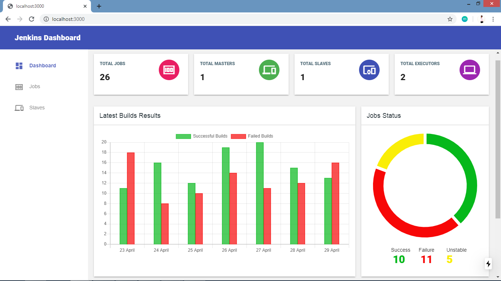

# Description

This is a web dashboard designed in Next JS to view Jenkins statistics and insights in real time.

The backend API is designed in Node JS which fetches data from Jenkins and store the data in mongo database.
The API can be found at https://github.com/sourabhgupta385/jenkins-dashboard-api

